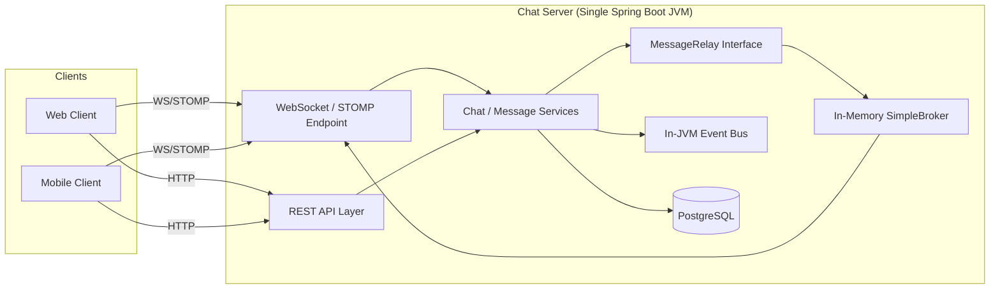
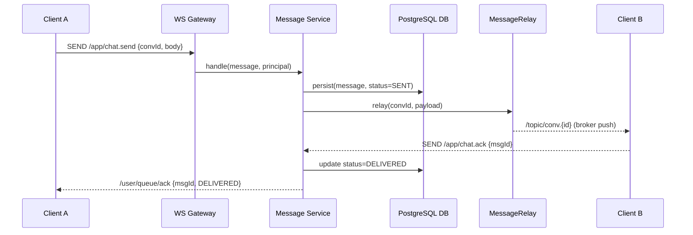
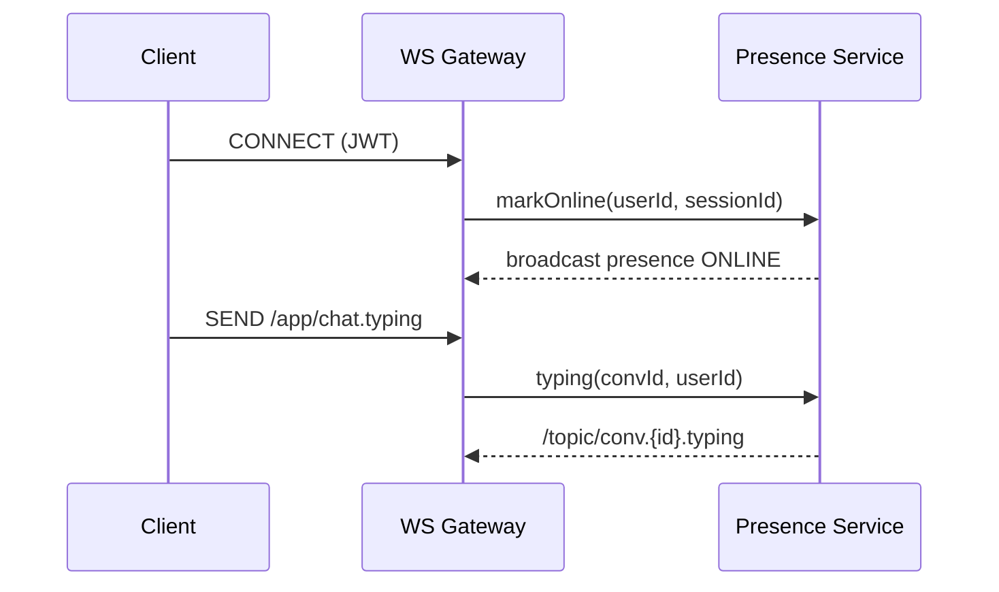
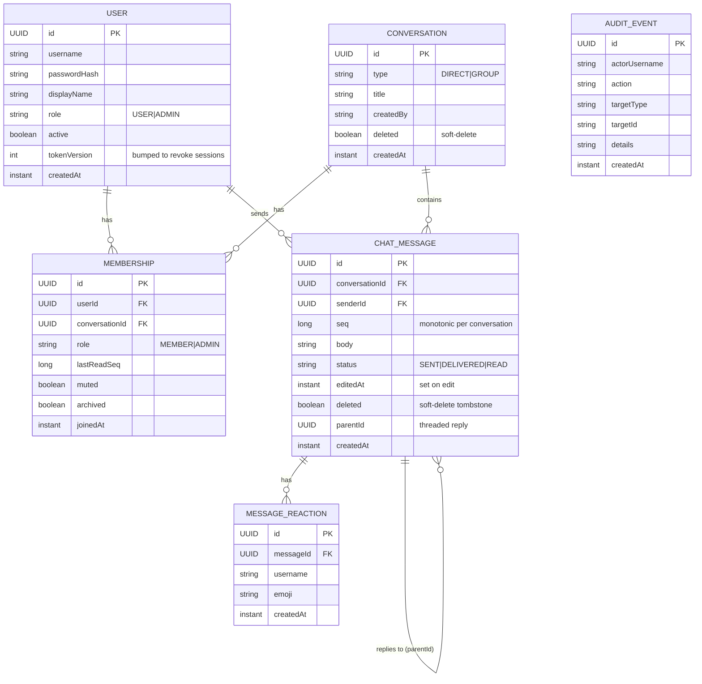
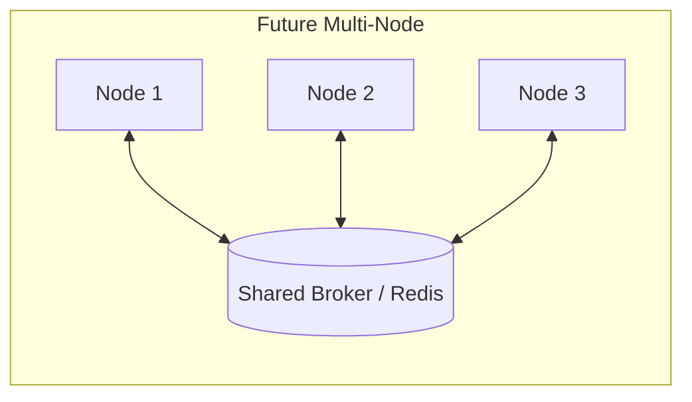

# 🚀 Scalable Real-Time Chat System — Design Document (HLD + LLD)

> **Constraint:** 100% free, no external infrastructure tools (no Kafka, SQS, RabbitMQ, Redis, Docker). Everything runs inside the JVM or as an embedded library.

---

## 1. Goals & Non-Goals

### Goals
- Real-time 1:1 and group messaging (WhatsApp/Slack style).
- Event-driven, cleanly layered architecture.
- Message persistence and delivery acknowledgements.
- Online/offline presence and typing indicators.
- Rich message actions: edit, soft-delete (tombstones), emoji reactions, threaded replies, and in-conversation search.
- Full group management: rename, add/remove members, member roles, mute/archive, delete/leave.
- Self-service profile: update display name, change password, delete account.
- Platform-level roles (USER/ADMIN) with an **admin console**: user management, conversation moderation, dashboard metrics, and an append-only **audit trail**.
- Security hardening: role-based authorization, JWT session revocation, and request rate limiting.
- "Distributed-ready" code — pluggable relay so Redis/Kafka can be added later **without** rewriting business logic.

### Non-Goals (current phase)
- True multi-node horizontal scaling (needs a shared broker — out of scope due to constraints).
- End-to-end encryption (can be added later).
- Media/file storage at scale (only metadata + small attachments initially).

---

## 2. Free Tech Stack

| Concern | Choice | Why |
|---|---|---|
| Language / Runtime | Java 21 (Temurin OpenJDK) | Free, LTS |
| Framework | Spring Boot 3.x | Free, batteries included |
| Real-time transport | Spring WebSocket + STOMP | Built-in |
| Message fan-out | Spring **SimpleBroker** (in-memory) | No external broker |
| Async/eventing | Spring `ApplicationEventPublisher` + `BlockingQueue` | In-JVM event-driven |
| Persistence | H2 file DB (`dev`) / PostgreSQL (`prod`) | Zero-setup dev; real DB in prod |
| Data access | Spring Data JPA | Free |
| API docs | springdoc-openapi (Swagger UI) | Interactive docs + JWT `Authorize` |
| Cache | Caffeine / `ConcurrentHashMap` | In-memory |
| Auth | Spring Security + JWT | Free |
| Build | Maven | Free |
| Deploy | `java -jar` | No Docker needed |

---

## 3. High-Level Design (HLD)

### 3.1 System Context



### 3.2 Logical Components

| Component | Responsibility |
|---|---|
| **WebSocket Gateway** | Handshake, session lifecycle, STOMP subscribe/send. |
| **Auth Module** | JWT issue/validate on HTTP + WS handshake; role + token-version claims. |
| **Chat Service** | Conversation/room CRUD, membership, group management (rename, members, roles, mute/archive), soft-delete/leave. |
| **Message Service** | Persist, sequence, deliver, ack messages; edit, soft-delete, reactions, threaded replies, search. |
| **Presence Service** | Online/offline + typing, backed by in-memory map. |
| **Profile Service** | Self-service display-name update, password change (rotates token), account deletion. |
| **Admin Service** | User management (create, role/status change, reset password, revoke sessions, delete) and dashboard stats. |
| **Admin Conversation Service** | Conversation oversight: list, soft-delete/restore, message moderation. |
| **Audit Service** | Append-only audit trail of sensitive actions, surfaced to admins. |
| **MessageRelay (interface)** | Abstraction for fan-out. Default = in-memory broker; future = Redis/Kafka. |
| **Event Bus** | Decouples side-effects (notifications, persistence, read receipts). |
| **Rate Limiter** | Token-bucket filter throttling auth and admin endpoints. |
| **Persistence** | Users, conversations, memberships, messages, reactions, audit events, delivery state. |

### 3.3 Key Flows

#### Send Message (happy path)


#### Presence / Typing


### 3.4 Scaling Strategy (within constraints)
- **Vertical scaling:** single JVM tuned for thousands of concurrent WebSocket sessions (raise file descriptors, thread pools, heap).
- **Pluggable relay:** `MessageRelay` interface isolates fan-out. Today: in-memory. Tomorrow: swap to `RedisMessageRelay` / `KafkaMessageRelay` for multi-node — **no service-layer change**.
- **Optional embedded broker:** ActiveMQ Artemis *embedded* (a Java dependency, not a separate service) enables STOMP relay if needed, still free.

---

## 4. Low-Level Design (LLD)

### 4.1 Package Structure
```
message-mesh-svc
com.message.mesh
├── MessageMeshApplication.java
├── config
│   ├── WebSocketConfig.java
│   ├── SecurityConfig.java          // role-based auth + rate-limit + MDC filters
│   ├── AsyncConfig.java
│   ├── OpenApiConfig.java           // springdoc / Swagger UI definition
│   └── AdminBootstrap.java          // promotes a configured user to ADMIN on startup
├── constant
│   └── AppConstants.java            // STOMP destinations + shared keys
├── controller
│   ├── ChatController.java          // @MessageMapping WS endpoints
│   ├── ConversationRestController.java   // list/create + group management + search
│   ├── MessageRestController.java   // edit / delete / reactions
│   ├── UserRestController.java      // profile self-service + directory + presence
│   ├── AuthRestController.java
│   ├── AdminRestController.java          // /api/admin/users
│   ├── AdminConversationRestController.java // /api/admin/conversations
│   ├── AdminStatsRestController.java     // /api/admin/stats
│   └── AdminAuditRestController.java     // /api/admin/audit
├── domain
│   ├── User.java                    // + role, active, tokenVersion
│   ├── Conversation.java            // + createdBy, deleted (soft-delete)
│   ├── Membership.java              // + muted, archived, joinedAt
│   ├── ChatMessage.java             // + editedAt, deleted, parentId (threading)
│   ├── MessageReaction.java         // emoji reactions
│   └── AuditEvent.java              // append-only audit trail
├── dto
│   ├── SendMessageRequest · MessageDto (parentPreview, reactions) · AckRequest · AckDto
│   ├── ConversationDto · ConversationMemberDto · CreateConversationRequest · ReadRequest
│   ├── RenameConversationRequest · AddMembersRequest · UpdateMemberRoleRequest · MembershipPrefsRequest
│   ├── EditMessageRequest · ReactionRequest · ConversationEvent
│   ├── TypingEvent · TypingNotification · PresenceDto
│   ├── RegisterRequest · LoginRequest · AuthResponse · UserDto
│   ├── UpdateProfileRequest · ChangePasswordRequest
│   ├── AdminUserDto · AdminUserDetailDto · CreateUserRequest · UpdateRoleRequest · UpdateStatusRequest · ResetPasswordRequest
│   ├── AdminConversationDto · AdminStatsDto · AuditEventDto
│   └── PagedResponse  // generic pagination envelope
├── enums
│   ├── ConversationType.java
│   ├── MembershipRole.java          // conversation-scoped (MEMBER|ADMIN)
│   ├── MessageStatus.java
│   ├── UserRole.java                // platform-scoped (USER|ADMIN)
│   └── UserStatus.java
├── event
│   ├── MessageCreatedEvent.java
│   ├── MessageEventListener.java
│   └── WebSocketEventListener.java  // STOMP connect/disconnect → presence
├── exception
│   ├── GlobalExceptionHandler.java
│   ├── ApiError.java
│   ├── BadRequestException.java
│   └── ResourceNotFoundException.java
├── logging
│   ├── MdcKeys.java
│   └── MdcLoggingFilter.java        // requestId/username/conversationId MDC
├── repository
│   ├── UserRepository.java
│   ├── ConversationRepository.java
│   ├── MembershipRepository.java
│   ├── MessageRepository.java
│   ├── MessageReactionRepository.java
│   └── AuditEventRepository.java
├── security
│   ├── JwtUtil.java                 // HS256, subject + token-version (tv) claim
│   ├── JwtAuthenticationFilter.java // resolves role authority + validates tv
│   ├── JwtHandshakeInterceptor.java
│   ├── WebSocketAuthChannelInterceptor.java
│   ├── RateLimitingFilter.java      // token-bucket throttling
│   └── CustomUserDetailsService.java
└── service
    ├── MessageService.java
    ├── MessageDtoAssembler.java     // enriches messages with reactions + reply previews
    ├── ConversationService.java
    ├── PresenceService.java
    ├── ProfileService.java
    ├── AuthService.java
    ├── AdminService.java
    ├── AdminConversationService.java
    ├── AuditService.java
    ├── SequenceGenerator.java
    └── relay
        ├── MessageRelay.java        // interface
        └── InMemoryMessageRelay.java
```

### 4.2 Data Model



### 4.3 Core Interfaces

**MessageRelay (the swap point for future scaling)**
```java
public interface MessageRelay {
    /** Fan a message out to all subscribers of a conversation. */
    void relay(UUID conversationId, MessageDto payload);

    /** Send to a single user's private queue. */
    void relayToUser(String username, String destination, Object payload);
}
```

**InMemoryMessageRelay (default implementation)**
```java
@Component
public class InMemoryMessageRelay implements MessageRelay {

    private final SimpMessagingTemplate template;

    public InMemoryMessageRelay(SimpMessagingTemplate template) {
        this.template = template;
    }

    @Override
    public void relay(UUID conversationId, MessageDto payload) {
        template.convertAndSend("/topic/conv." + conversationId, payload);
    }

    @Override
    public void relayToUser(String username, String destination, Object payload) {
        template.convertAndSendToUser(username, destination, payload);
    }
}
```

### 4.4 WebSocket Configuration
```java
@Configuration
@EnableWebSocketMessageBroker
public class WebSocketConfig implements WebSocketMessageBrokerConfigurer {

    @Override
    public void configureMessageBroker(MessageBrokerRegistry registry) {
        // In-memory simple broker — no Redis/RabbitMQ needed
        registry.enableSimpleBroker("/topic", "/queue");
        registry.setApplicationDestinationPrefixes("/app");
        registry.setUserDestinationPrefix("/user");
    }

    @Override
    public void registerStompEndpoints(StompEndpointRegistry registry) {
        registry.addEndpoint("/ws")
                .addInterceptors(new JwtHandshakeInterceptor())
                .setAllowedOriginPatterns("*")
                .withSockJS();
    }
}
```

### 4.5 Chat Controller (WS endpoints)
```java
@Controller
public class ChatController {

    private final MessageService messageService;

    public ChatController(MessageService messageService) {
        this.messageService = messageService;
    }

    @MessageMapping("/chat.send")
    public void send(@Payload SendMessageRequest req, Principal principal) {
        messageService.handleSend(principal.getName(), req);
    }

    @MessageMapping("/chat.ack")
    public void ack(@Payload AckRequest req, Principal principal) {
        messageService.handleAck(principal.getName(), req);
    }

    @MessageMapping("/chat.typing")
    public void typing(@Payload TypingEvent ev, Principal principal) {
        messageService.handleTyping(principal.getName(), ev);
    }
}
```

### 4.6 Message Service (core logic)
```java
@Service
public class MessageService {

    private final MessageRepository messageRepo;
    private final MessageRelay relay;
    private final ApplicationEventPublisher events;
    private final SequenceGenerator seq; // per-conversation monotonic seq

    // constructor omitted for brevity

    @Transactional
    public void handleSend(String senderUsername, SendMessageRequest req) {
        long nextSeq = seq.next(req.conversationId());

        ChatMessage msg = ChatMessage.builder()
                .conversationId(req.conversationId())
                .senderUsername(senderUsername)
                .seq(nextSeq)
                .body(req.body())
                .status(MessageStatus.SENT)
                .createdAt(Instant.now())
                .build();

        messageRepo.save(msg);

        MessageDto dto = MessageDto.from(msg);
        relay.relay(req.conversationId(), dto);           // real-time fan-out
        events.publishEvent(new MessageCreatedEvent(dto)); // async side-effects
    }

    @Transactional
    public void handleAck(String username, AckRequest req) {
        messageRepo.updateStatus(req.messageId(), MessageStatus.DELIVERED);
        relay.relayToUser(username, "/queue/ack",
                new AckDto(req.messageId(), MessageStatus.DELIVERED));
    }
}
```

### 4.7 Async Event Handling (in-JVM, replaces a message queue)
```java
@Component
public class MessageEventListener {

    @Async
    @EventListener
    public void onMessageCreated(MessageCreatedEvent event) {
        // e.g., push notifications, unread counters, analytics — non-blocking
    }
}
```
```java
@Configuration
@EnableAsync
public class AsyncConfig {
    @Bean
    public Executor taskExecutor() {
        ThreadPoolTaskExecutor ex = new ThreadPoolTaskExecutor();
        ex.setCorePoolSize(4);
        ex.setMaxPoolSize(16);
        ex.setQueueCapacity(1000);
        ex.setThreadNamePrefix("chat-evt-");
        ex.initialize();
        return ex;
    }
}
```

### 4.8 Presence Service (in-memory)
```java
@Service
public class PresenceService {

    private final Map<String, Set<String>> onlineUsers = new ConcurrentHashMap<>();
    private final MessageRelay relay;

    public void markOnline(String username, String sessionId) {
        onlineUsers.computeIfAbsent(username, k -> ConcurrentHashMap.newKeySet())
                   .add(sessionId);
        broadcastPresence(username, true);
    }

    public void markOffline(String username, String sessionId) {
        Set<String> sessions = onlineUsers.get(username);
        if (sessions != null) {
            sessions.remove(sessionId);
            if (sessions.isEmpty()) {
                onlineUsers.remove(username);
                broadcastPresence(username, false);
            }
        }
    }

    private void broadcastPresence(String username, boolean online) {
        relay.relayToUser(username, "/queue/presence",
                new PresenceDto(username, online));
    }
}
```

### 4.9 Security (JWT on HTTP + WS handshake)
```java
public class JwtHandshakeInterceptor implements HandshakeInterceptor {
    @Override
    public boolean beforeHandshake(ServerHttpRequest request, ServerHttpResponse response,
                                   WebSocketHandler handler, Map<String, Object> attrs) {
        String token = extractToken(request);
        if (token == null || !JwtUtil.isValid(token)) {
            response.setStatusCode(HttpStatus.UNAUTHORIZED);
            return false;
        }
        attrs.put("username", JwtUtil.getUsername(token));
        return true;
    }
    @Override
    public void afterHandshake(ServerHttpRequest req, ServerHttpResponse res,
                               WebSocketHandler h, Exception ex) { }
}
```

### 4.10 STOMP Destination Map

| Direction | Destination | Purpose |
|---|---|---|
| Client → Server | `/app/chat.send` | Send a message (supports `parentId` for replies) |
| Client → Server | `/app/chat.ack` | Acknowledge delivery/read |
| Client → Server | `/app/chat.typing` | Typing indicator |
| Server → Clients | `/topic/conv.{id}` | Conversation broadcast (new/edited/deleted messages, reactions) |
| Server → Clients | `/topic/conv.{id}.typing` | Typing broadcast |
| Server → Clients | `/topic/conv.{id}.meta` | Conversation meta events (rename, member add/remove, role change, delete) |
| Server → Clients | `/topic/presence` | Presence (online/offline) broadcast |
| Server → User | `/user/queue/ack` | Per-user delivery/read ack |
| Server → User | `/user/queue/conversations` | Per-user conversation-list updates |

### 4.11 REST API (non-realtime)

**Authentication**
| Method | Path | Purpose |
|---|---|---|
| POST | `/api/auth/register` | Create account (returns JWT) |
| POST | `/api/auth/login` | Get JWT |

**Conversations & group management**
| Method | Path | Purpose |
|---|---|---|
| GET | `/api/conversations` | List user conversations |
| POST | `/api/conversations` | Create direct/group |
| GET | `/api/conversations/{id}/messages?afterSeq=&limit=` | Paginated history |
| GET | `/api/conversations/{id}/messages/search?q=&page=&size=` | Search within a conversation |
| POST | `/api/conversations/{id}/read` | Mark read up to seq |
| GET | `/api/conversations/{id}/members` | List members + roles |
| POST | `/api/conversations/{id}/members` | Add members (group admin) |
| DELETE | `/api/conversations/{id}/members/{userId}` | Remove member / leave |
| PATCH | `/api/conversations/{id}/members/{userId}/role` | Change member role (group admin) |
| PATCH | `/api/conversations/{id}` | Rename group (group admin) |
| PATCH | `/api/conversations/{id}/membership` | Toggle caller's mute/archive |
| DELETE | `/api/conversations/{id}` | Delete (group admin) or leave |

**Messages**
| Method | Path | Purpose |
|---|---|---|
| PATCH | `/api/messages/{id}` | Edit a message (author only) |
| DELETE | `/api/messages/{id}` | Soft-delete a message (author or group admin) |
| POST | `/api/messages/{id}/reactions` | Add an emoji reaction |
| DELETE | `/api/messages/{id}/reactions/{emoji}` | Remove the caller's reaction |

**Users & profile**
| Method | Path | Purpose |
|---|---|---|
| GET | `/api/users` | List other users |
| GET | `/api/users/me` | Current user profile |
| PATCH | `/api/users/me` | Update own display name |
| POST | `/api/users/me/password` | Change password (returns fresh JWT) |
| DELETE | `/api/users/me` | Delete own account |
| GET | `/api/users/online` | Online usernames |

**Admin (requires `ADMIN` role)**
| Method | Path | Purpose |
|---|---|---|
| GET | `/api/admin/stats` | Dashboard aggregate metrics |
| GET | `/api/admin/users?q=&role=&active=&page=&size=` | List users (paginated) |
| POST | `/api/admin/users` | Create a user |
| GET | `/api/admin/users/{id}` | User detail + conversations |
| PATCH | `/api/admin/users/{id}/role` | Promote/demote (USER↔ADMIN) |
| PATCH | `/api/admin/users/{id}/status` | Activate/deactivate |
| POST | `/api/admin/users/{id}/reset-password` | Reset a user's password |
| POST | `/api/admin/users/{id}/revoke-sessions` | Force logout (bump token version) |
| DELETE | `/api/admin/users/{id}` | Delete a user |
| GET | `/api/admin/conversations?q=&type=&deleted=&page=&size=` | List conversations |
| DELETE | `/api/admin/conversations/{id}` | Soft-delete a conversation |
| POST | `/api/admin/conversations/{id}/restore` | Restore a soft-deleted conversation |
| GET | `/api/admin/conversations/{id}/messages?page=&size=` | List messages (moderation) |
| DELETE | `/api/admin/conversations/{id}/messages/{messageId}` | Delete a message (moderation) |
| GET | `/api/admin/audit?actor=&action=&from=&to=&page=&size=` | Audit trail |

> **Guardrails:** the last remaining administrator cannot be demoted, deactivated, or deleted, and admins cannot demote/deactivate/delete themselves into lockout.

> **API docs & ops:** OpenAPI spec at `/v3/api-docs`, interactive Swagger UI at `/swagger-ui.html` (JWT `Authorize` dialog). Actuator exposes `/actuator/health`, `/actuator/info`, `/actuator/metrics`.

### 4.12 Authorization, Session Control & Rate Limiting

**Platform roles.** Every user carries a platform-level `UserRole` (`USER` or `ADMIN`), distinct from the conversation-scoped `MembershipRole`. The JWT embeds a token-version claim (`tv`); `JwtAuthenticationFilter` grants a `ROLE_ADMIN`/`ROLE_USER` authority and rejects tokens whose `tv` no longer matches the stored value. Method security (`@EnableMethodSecurity`) plus `@PreAuthorize("hasRole('ADMIN')")` guard the `/api/admin/**` surface, which is also matched in the security filter chain.

**Session revocation (force logout).** Bumping a user's `tokenVersion` (via *reset password*, *change password*, or admin *revoke sessions*) instantly invalidates every outstanding JWT for that account across all devices.

**Admin bootstrap.** `AdminBootstrap` promotes a configured existing user (`app.admin.bootstrap-username`) to `ADMIN` on startup when no administrator exists — no hard-coded credentials, and it never creates accounts.

**Rate limiting.** `RateLimitingFilter` applies in-memory token buckets to sensitive endpoints (auth and admin), configurable via `app.rate-limit.*`. Over-limit callers receive `429 Too Many Requests`.

**Audit trail.** `AuditService` writes append-only `AuditEvent` rows (actor, action, target, details, timestamp) for sensitive operations (role/status changes, deletes, moderation, session revocation). Admins browse and filter them via `/api/admin/audit`.

```java
// Admin endpoints are role-guarded at both the URL and method level
@RestController
@RequestMapping("/api/admin/users")
@PreAuthorize("hasRole('ADMIN')")
public class AdminRestController { /* list, create, role, status, reset-password, revoke-sessions, delete */ }
```

---

## 5. Message Delivery & Reliability

- **Per-conversation `seq`** gives total ordering and gap detection.
- **Client sync on reconnect:** `GET /messages?afterSeq=lastReadSeq` fetches missed messages (offline support without a broker).
- **Status lifecycle:** `SENT → DELIVERED → READ`, persisted in DB.
- **At-least-once** delivery; client dedups by message `id`.

---

## 6. Persistence Configuration (H2 file mode)
```properties
spring.datasource.url=jdbc:h2:file:./data/chatdb;AUTO_SERVER=TRUE
spring.datasource.driver-class-name=org.h2.Driver
spring.jpa.hibernate.ddl-auto=update
spring.jpa.database-platform=org.hibernate.dialect.H2Dialect
spring.h2.console.enabled=true
```

### Application configuration keys (`app.*`)
```yaml
app:
  jwt:
    secret: ${APP_JWT_SECRET:...}          # HS256 signing key (override in prod)
    expiration-ms: ${APP_JWT_EXPIRATION_MS:86400000}
  admin:
    bootstrap-username: ${APP_ADMIN_USERNAME:alice}  # promoted to ADMIN if no admin exists
  cors:
    allowed-origins: ${APP_CORS_ALLOWED_ORIGINS:*}
  rate-limit:
    enabled: ${APP_RATE_LIMIT_ENABLED:true}
    auth:  { capacity: 10,  refill-per-minute: 10 }   # /api/auth/**
    admin: { capacity: 120, refill-per-minute: 120 }  # /api/admin/**
```

---

## 7. Deployment (no Docker)
```bash
# Build
./mvnw clean package

# Run
java -jar target/chat-system-1.0.0.jar

# Tune for many WebSocket connections (Linux)
ulimit -n 65535
java -Xms512m -Xmx2g -jar target/chat-system-1.0.0.jar
```

---

## 8. Future-Proofing for True Horizontal Scaling

When the office allows external tools, scaling requires **only**:
1. Implement `RedisMessageRelay` (or `KafkaMessageRelay`) against the existing `MessageRelay` interface.
2. Switch `enableSimpleBroker(...)` to `enableStompBrokerRelay(...)`.
3. Move presence map to a shared store.

> **No changes to controllers, services, or domain logic.** The abstraction is the insurance policy.



---

## 9. Summary

| Aspect | Decision |
|---|---|
| Real-time | Spring WebSocket + STOMP |
| Fan-out | In-memory SimpleBroker behind `MessageRelay` |
| Eventing | Spring events + `@Async` (no Kafka/MQ) |
| Storage | Embedded H2 (no external DB) |
| Cache/Presence | `ConcurrentHashMap` / Caffeine |
| Message actions | Edit, soft-delete (tombstones), reactions, threaded replies, search |
| Group management | Rename, add/remove members, member roles, mute/archive, delete/leave |
| Profile | Display-name update, password change, account deletion |
| Admin & moderation | Role-based admin console, user management, conversation/message moderation, dashboard stats |
| Audit | Append-only `AuditEvent` trail surfaced to admins |
| Security | JWT + platform roles, method security, token-version session revocation, rate limiting |
| Deploy | `java -jar` (no Docker) |
| Scaling | Vertical now; pluggable relay for horizontal later |
| Cost | **$0** |
