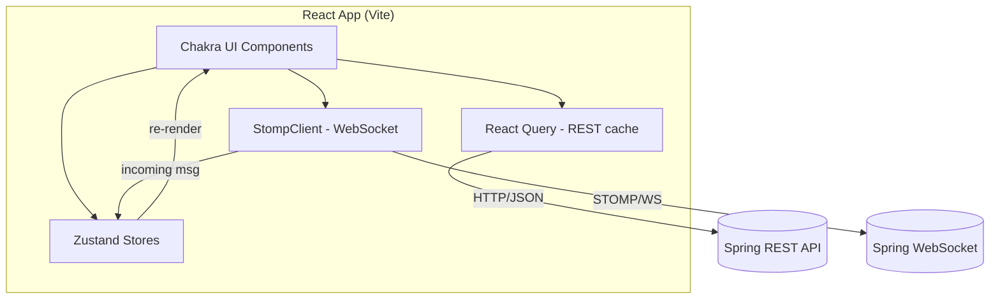
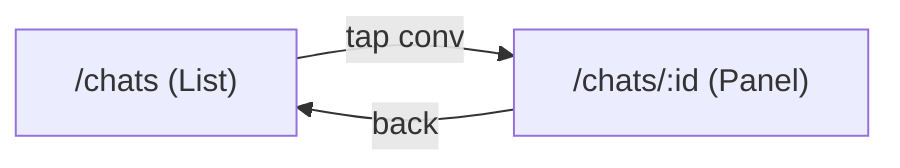
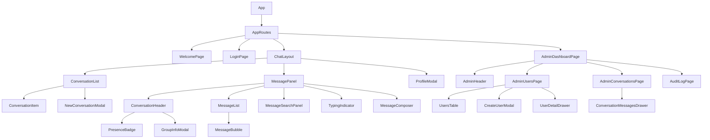
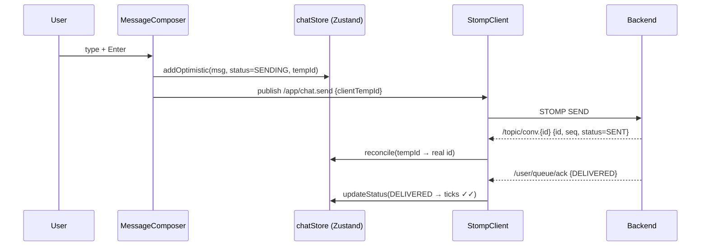

# 🎨 Real-Time Chat System — UI Design Document

> **Stack:** React 18 + TypeScript + Chakra UI + Vite
> **Backend contract:** Spring Boot WebSocket (STOMP) + REST (see [BACKEND-DESIGN.md](BACKEND-DESIGN.md))

---

## 1. Goals

- Responsive, accessible chat UI (WhatsApp/Slack style).
- Real-time messaging via STOMP over WebSocket.
- Optimistic UI with delivery/read receipts.
- Presence + typing indicators.
- Rich messaging: emoji reactions, edit, delete (tombstones), threaded replies, and in-conversation search.
- Group management: rename, add/remove members, member roles, mute/archive, delete/leave.
- Self-service profile: display name, password change, account deletion.
- **Admin console**: dashboard metrics, user management, conversation/message moderation, and an audit-log viewer with CSV export.
- Desktop notifications and an unread-count tab-title badge.
- Light/dark mode (Chakra built-in).
- Clean, swappable data layer (REST + WS abstracted behind hooks).

---

## 2. Tech Stack & Required Libraries

| Concern | Library | Why |
|---|---|---|
| Framework | **React 18** | Concurrent features, hooks |
| Language | **TypeScript** | Type-safe DTOs shared with backend contract |
| Build tool | **Vite** | Fast dev server + HMR |
| UI components | **Chakra UI** | Accessible, themeable, fast to build |
| Icons | `@chakra-ui/icons` + `react-icons` | Rich icon set |
| Routing | **React Router v6** | SPA navigation |
| Server state | **TanStack Query (React Query)** | Caching, pagination, retries for REST |
| Client state | **Zustand** | Lightweight global store (auth, presence, active conv) |
| WebSocket/STOMP | **@stomp/stompjs** + **sockjs-client** | Matches Spring STOMP backend |
| Forms | **React Hook Form** + **Zod** | Validation, typed schemas |
| HTTP | **Axios** | Interceptors for JWT |
| Date/time | **date-fns** | Lightweight formatting |
| Testing | **Vitest** + **React Testing Library** | Vite-native unit tests |
| E2E (optional) | **Playwright** | Real-time flow testing |
| Lint/format | **ESLint** + **Prettier** | Code quality |

### Suggested additions (recommended)
- **`react-virtuoso`** — virtualized message list for long chat histories (performance).
- **`emoji-mart`** — emoji picker.
- **`react-dropzone`** — file/image attachments.
- **`framer-motion`** — smooth message/typing animations (Chakra integrates well).
- **`i18next`** — internationalization, if multi-language needed.
- **`workbox`** (PWA) — offline shell + installable app.

---

## 3. Project Structure

```
message-mesh-ui
src/
├── main.tsx
├── App.tsx
├── theme/
│   └── index.ts                 // Chakra theme, colors, dark mode config
├── api/
│   ├── axiosClient.ts           // axios + JWT interceptor
│   ├── auth.api.ts
│   ├── conversation.api.ts
│   ├── message.api.ts           // edit / delete / reactions / search
│   ├── user.api.ts              // profile self-service + directory
│   └── admin.api.ts             // admin users/conversations/stats/audit
├── ws/
│   ├── StompClient.ts           // STOMP connection manager
│   ├── SocketContext.ts         // React context for the live socket
│   └── SocketProvider.tsx       // provider: lifecycle + subscriptions (incl. .meta)
├── store/
│   ├── authStore.ts             // Zustand: token, user (with role)
│   ├── chatStore.ts             // active conversation, drafts, reply target
│   └── presenceStore.ts         // online users, typing state
├── hooks/
│   ├── useAuth.ts
│   ├── useConversations.ts      // React Query
│   ├── useConversationMembers.ts// React Query (group roster)
│   ├── useConversationMutations.ts // rename, members, roles, mute/archive, delete/leave
│   ├── useMessages.ts           // React Query (pagination by seq)
│   ├── useMessageActions.ts     // edit / delete / react
│   ├── useMessageSearch.ts      // in-conversation search
│   ├── useSendMessage.ts        // optimistic send via STOMP
│   ├── usePresence.ts
│   ├── useProfile.ts            // update profile / password / delete account
│   ├── useUnreadTitle.ts        // unread-count tab-title badge
│   ├── useAdminStats.ts
│   ├── useAdminUsers.ts
│   ├── useAdminConversations.ts
│   └── useAuditLog.ts
├── features/
│   ├── auth/
│   │   ├── LoginPage.tsx
│   │   └── RegisterPage.tsx
│   ├── chat/
│   │   ├── ChatLayout.tsx
│   │   ├── ConversationList.tsx
│   │   ├── ConversationItem.tsx
│   │   ├── ConversationHeader.tsx
│   │   ├── MessagePanel.tsx
│   │   ├── MessageList.tsx
│   │   ├── MessageBubble.tsx
│   │   ├── MessageComposer.tsx
│   │   ├── MessageSearchPanel.tsx
│   │   ├── TypingIndicator.tsx
│   │   ├── NewConversationModal.tsx
│   │   ├── GroupInfoModal.tsx
│   │   ├── ProfileModal.tsx
│   │   └── reactions.ts          // fixed emoji palette (mirrors backend)
│   ├── admin/
│   │   ├── AdminDashboardPage.tsx
│   │   ├── AdminUsersPage.tsx
│   │   ├── AdminConversationsPage.tsx
│   │   ├── AuditLogPage.tsx
│   │   ├── AdminHeader.tsx
│   │   ├── UsersTable.tsx
│   │   ├── CreateUserModal.tsx
│   │   ├── UserDetailDrawer.tsx
│   │   └── ConversationMessagesDrawer.tsx
│   └── welcome/
│       └── WelcomePage.tsx
├── components/                   // shared dumb components
│   ├── Avatar.tsx
│   ├── BrandLogo.tsx
│   ├── ColorModeToggle.tsx
│   ├── ConnectionStatus.tsx
│   ├── EmptyState.tsx
│   └── PresenceBadge.tsx
├── types/
│   ├── dto.ts                   // mirrors backend DTOs (incl. admin/audit/reactions)
│   └── stomp.ts                 // destination + payload types (incl. .meta)
├── routes/
│   ├── AppRoutes.tsx            // chat + /admin/* routes
│   └── guards.tsx               // RequireAuth · PublicOnly · RequireAdmin
└── utils/
    ├── jwt.ts
    ├── id.ts
    ├── csv.ts                   // audit-log CSV export
    ├── notifications.ts         // desktop notifications
    └── formatters.ts
```

---

## 4. High-Level UI Architecture



- **REST (React Query):** history, conversations, auth, read receipts — cacheable request/response.
- **WebSocket (STOMP):** live messages, typing, presence, acks — push.
- **Zustand:** holds ephemeral real-time state pushed from WS.

---

## 5. Screen Layout

### 5.1 Main Chat Layout (desktop)
```
┌─────────────────────────────────────────────────────────┐
│  Top Bar:  Logo | Search | ConnectionStatus | Avatar ▾   │
├───────────────┬─────────────────────────────────────────┤
│ Conversation  │  Conversation Header (name, presence)    │
│ List          ├─────────────────────────────────────────┤
│               │                                          │
│ ▸ Alice  ●    │   MessageList (virtualized)              │
│ ▸ Team   ②    │     ┌ incoming bubble                    │
│ ▸ Bob    ●    │     outgoing bubble ┐  ✓✓                │
│               │                                          │
│               ├─────────────────────────────────────────┤
│               │  TypingIndicator                         │
│               │  MessageComposer [emoji|attach|input|➤]  │
└───────────────┴─────────────────────────────────────────┘
```

### 5.2 Responsive (mobile)
- Single column: `ConversationList` ↔ `MessagePanel` via React Router routes.
- `< md` breakpoint → list is a route (`/chats`), opening a conversation pushes `/chats/:id`.



---

## 6. Component Specifications (LLD)

### 6.1 Component Tree


### 6.2 Key Component Contracts

| Component | Props | Responsibility |
|---|---|---|
| `ChatLayout` | — | Grid shell; wires stores + WS lifecycle; unread tab-title badge. |
| `ConversationList` | — | Lists conversations (React Query), unread badges, mute/archive state. |
| `ConversationItem` | `conversation, isActive` | Single row; presence dot, last message preview. |
| `ConversationHeader` | `conversation` | Title, presence/member count; opens group info; search toggle. |
| `MessageList` | `conversationId` | Infinite scroll history + live appends (virtualized). |
| `MessageBubble` | `message, isOwn` | Bubble, timestamp, status ticks, reactions, edit/delete/reply actions. |
| `MessageComposer` | `conversationId` | Input, emoji, send; emits typing; reply-to context. |
| `MessageSearchPanel` | `conversationId` | In-conversation message search with paged results. |
| `TypingIndicator` | `conversationId` | Shows "X is typing…" from presence store. |
| `NewConversationModal` | `isOpen, onClose` | User picker; create DIRECT/GROUP conversation. |
| `GroupInfoModal` | `conversationId, isOpen, onClose` | Group roster + management (rename, add/remove, roles, leave). |
| `ProfileModal` | `isOpen, onClose` | Edit display name, change password, delete account. |
| `PresenceBadge` | `userId` | Online/offline dot. |
| `ConnectionStatus` | — | WS connected/reconnecting banner. |
| `WelcomePage` | — | Landing/empty state before a conversation is open. |
| `AdminDashboardPage` | — | Admin shell + aggregate stats cards. |
| `AdminUsersPage` | — | Paginated/filterable user management (`UsersTable`). |
| `UsersTable` | `users, …` | Row actions: role, activate/deactivate, reset password, revoke sessions, delete. |
| `CreateUserModal` | `isOpen, onClose` | Provision a new user with role. |
| `UserDetailDrawer` | `userId, isOpen, onClose` | User detail + conversations drill-down. |
| `AdminConversationsPage` | — | Conversation moderation: list, soft-delete/restore. |
| `ConversationMessagesDrawer` | `conversationId, …` | Review/delete individual messages. |
| `AuditLogPage` | — | Filterable audit trail with CSV export. |

---

## 7. TypeScript Contracts (mirror backend DTOs)

```typescript
// types/dto.ts
export type ConversationType = 'DIRECT' | 'GROUP';
export type MessageStatus = 'SENT' | 'DELIVERED' | 'READ';
export type MembershipRole = 'ADMIN' | 'MEMBER';   // conversation-scoped
export type UserRole = 'USER' | 'ADMIN';           // platform-scoped

export interface UserDto {
  id: string;
  username: string;
  displayName: string;
  role: UserRole;
}

export interface ConversationDto {
  id: string;
  type: ConversationType;
  title: string;
  lastMessage?: MessageDto | null;
  unreadCount: number;
  memberCount: number;
  muted: boolean;
  archived: boolean;
}

export interface MessageReactionSummary {
  emoji: string;
  count: number;
  usernames: string[];
}

export interface MessageParentPreview {
  id: string;
  senderUsername: string;
  body: string;
}

export interface MessageDto {
  id: string;
  conversationId: string;
  senderUsername: string;
  seq: number;
  body: string;
  status: MessageStatus;
  createdAt: string;              // ISO
  clientTempId?: string | null;   // optimistic dedup
  editedAt?: string | null;
  deleted: boolean;               // tombstone
  parentId?: string | null;       // threaded reply
  parentPreview?: MessageParentPreview | null;
  reactions: MessageReactionSummary[];
}

// Generic pagination envelope (backend PagedResponse)
export interface PagedResponse<T> {
  content: T[];
  page: number;
  size: number;
  totalElements: number;
  totalPages: number;
}

// Admin-only projections
export interface AdminUserDto {
  id: string; username: string; displayName: string;
  role: UserRole; active: boolean; createdAt: string;
  online: boolean; conversationCount: number;
}
export interface AdminStatsDto {
  totalUsers: number; activeUsers: number; adminUsers: number; onlineUsers: number;
  totalConversations: number; totalMessages: number; auditEvents: number; /* …and more */
}
export interface AuditEventDto {
  id: string; actorUsername: string; action: string;
  targetType?: string | null; targetId?: string | null;
  details?: string | null; createdAt: string;
}

// outgoing payloads
export interface SendMessageRequest {
  conversationId: string;
  body: string;
  clientTempId: string;           // for optimistic dedup
  parentId?: string | null;       // reply target
}

export interface AckRequest { messageId: string; }
export interface TypingEvent { conversationId: string; }
export interface EditMessageRequest { body: string; }
export interface RenameConversationRequest { title: string; }
export interface AddMembersRequest { usernames: string[]; }
export interface MembershipPrefsRequest { muted?: boolean; archived?: boolean; }
export interface UpdateProfileRequest { displayName: string; }
export interface ChangePasswordRequest { currentPassword: string; newPassword: string; }
```

```typescript
// types/stomp.ts — destinations match backend STOMP map (AppConstants)
export const STOMP = {
  send:   '/app/chat.send',
  ack:    '/app/chat.ack',
  typing: '/app/chat.typing',
  topicConversation: (id: string) => `/topic/conv.${id}`,
  topicTyping: (id: string) => `/topic/conv.${id}.typing`,
  topicConversationMeta: (id: string) => `/topic/conv.${id}.meta`,
  topicPresence: '/topic/presence',
  userAck: '/user/queue/ack',
  userConversations: '/user/queue/conversations',
} as const;

// Conversation/membership meta event pushed on the .meta topic
export type ConversationEventType =
  | 'RENAMED' | 'MEMBER_ADDED' | 'MEMBER_REMOVED'
  | 'MEMBER_ROLE_CHANGED' | 'CONVERSATION_DELETED';
```

---

## 8. WebSocket (STOMP) Client

```typescript
// ws/StompClient.ts
import { Client, IMessage } from '@stomp/stompjs';
import SockJS from 'sockjs-client';

export class StompClient {
  private client: Client;

  constructor(token: string) {
    this.client = new Client({
      webSocketFactory: () => new SockJS('/ws'),
      connectHeaders: { Authorization: `Bearer ${token}` },
      reconnectDelay: 3000,
      heartbeatIncoming: 10000,
      heartbeatOutgoing: 10000,
    });
  }

  activate(onConnect: () => void) {
    this.client.onConnect = onConnect;
    this.client.activate();
  }

  subscribe(destination: string, cb: (msg: IMessage) => void) {
    return this.client.subscribe(destination, cb);
  }

  publish(destination: string, body: unknown) {
    this.client.publish({ destination, body: JSON.stringify(body) });
  }

  deactivate() {
    this.client.deactivate();
  }
}
```

---

## 9. Optimistic Send Flow



- **Optimistic message** appears instantly with a clock/SENDING state.
- On broker echo, reconcile `clientTempId` → server `id`/`seq`.
- On ack, upgrade status to DELIVERED/READ.

---

## 10. Chakra UI Theme

```typescript
// theme/index.ts
import { extendTheme, type ThemeConfig } from '@chakra-ui/react';

const config: ThemeConfig = {
  initialColorMode: 'system',
  useSystemColorMode: true,
};

export const theme = extendTheme({
  config,
  colors: {
    brand: {
      50: '#e6f2ff', 500: '#1a73e8', 600: '#1666c1', 700: '#0f4c8a',
    },
    sent: { bubble: '#dcf8c6' },
  },
  components: {
    // bubble, composer overrides...
  },
});
```

```typescript
// App.tsx
<ChakraProvider theme={theme}>
  <ColorModeScript initialColorMode={theme.config.initialColorMode} />
  <QueryClientProvider client={queryClient}>
    <AppRoutes />
  </QueryClientProvider>
</ChakraProvider>
```

---

## 11. State Management Split

| State | Where | Reason |
|---|---|---|
| JWT, current user | Zustand `authStore` (persisted) | Global, survives reload |
| Conversation list, history | React Query | Cacheable server state, pagination |
| Active conversation id, drafts | Zustand `chatStore` | UI/ephemeral |
| Online users, typing | Zustand `presenceStore` | Pushed from WS, high-frequency |
| Optimistic/in-flight messages | Zustand `chatStore` | Reconciled with WS echoes |

---

## 12. Accessibility & UX

- Chakra's built-in ARIA roles + keyboard nav.
- Composer: `Enter` to send, `Shift+Enter` newline.
- Focus management on conversation switch.
- `prefers-reduced-motion` respected (framer-motion guard).
- Color-contrast safe bubbles in both modes.
- Screen-reader live region for new incoming messages.

---

## 13. Vite Config Essentials

```typescript
// vite.config.ts
import { defineConfig } from 'vite';
import react from '@vitejs/plugin-react';

export default defineConfig({
  plugins: [react()],
  server: {
    proxy: {
      '/api': 'http://localhost:8080',
      '/ws': { target: 'http://localhost:8080', ws: true },
    },
  },
});
```

---

## 14. Setup Commands

```bash
# Scaffold
npm create vite@latest chat-ui -- --template react-ts
cd chat-ui

# Core deps
npm i @chakra-ui/react @emotion/react @emotion/styled framer-motion
npm i @chakra-ui/icons react-icons
npm i react-router-dom @tanstack/react-query zustand axios
npm i @stomp/stompjs sockjs-client date-fns
npm i react-hook-form zod @hookform/resolvers

# Recommended extras
npm i react-virtuoso emoji-mart @emoji-mart/react react-dropzone

# Dev/test
npm i -D vitest @testing-library/react @testing-library/jest-dom
npm i -D eslint prettier @types/sockjs-client

npm run dev
```

---

## 15. Folder-to-Backend Mapping

| Frontend | Backend (BACKEND-DESIGN.md) |
|---|---|
| `api/*.api.ts` | REST controllers (`/api/...`) |
| `api/admin.api.ts` | Admin controllers (`/api/admin/...`) |
| `api/message.api.ts` | `MessageRestController` (edit/delete/reactions) + conversation search |
| `ws/StompClient.ts` | `/ws` STOMP endpoint |
| `types/dto.ts` | Java DTOs (`MessageDto`, `AdminUserDto`, `AuditEventDto`, …) |
| `types/stomp.ts` | STOMP destination map (§4.10), incl. `.meta` events |
| `useMessages` pagination | `GET /messages?afterSeq=` |
| `routes/guards.tsx` `RequireAdmin` | `@PreAuthorize("hasRole('ADMIN')")` on `/api/admin/**` |

---

## 16. Summary

| Aspect | Decision |
|---|---|
| UI kit | Chakra UI (accessible, themeable) |
| Build | Vite (fast HMR) |
| Server state | React Query |
| Client state | Zustand |
| Real-time | @stomp/stompjs + SockJS |
| Forms | React Hook Form + Zod |
| Long lists | react-virtuoso (recommended) |
| Messaging | Reactions, edit/delete, threaded replies, in-conversation search |
| Group management | Rename, members, roles, mute/archive, delete/leave |
| Profile | Display name, password change, account deletion |
| Admin console | Dashboard, user management, moderation, audit log (CSV export) |
| Auth guards | `RequireAuth` · `PublicOnly` · `RequireAdmin` |
| Cost | **$0** (all OSS) |

> Frontend mirrors the backend's `MessageRelay`/STOMP contract, so swapping the in-memory broker for Redis/Kafka later requires **zero UI changes**.
